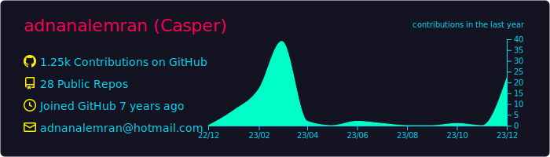

<div align="center">


[](https://git.io/typing-svg)

 

[](https://github.com/adnanalemran)
[](https://adnanalemran.vercel.app)
[](https://linkedin.com/in/adnanalemran)


</div>

<div align="center">

## 🚀 About Me

<table>
<tr>
<td width="50%">

> 💡 **Passionate Full Stack Developer crafting digital experiences that matter**

I'm a **Full Stack Developer** with deep expertise in modern web technologies, specializing in creating scalable, high-performance applications. My journey spans across the **MERN stack**, **Laravel ecosystem**, and **Microsoft .NET platform**, with a strong foundation in both **SQL** and **NoSQL** databases.

🌟 **Current Focus**: Building enterprise-grade solutions  
📍 **Location**: Bangladesh 🇧🇩  
💼 **Experience**: 5+ years in full-stack development  
🎯 **Goal**: Contributing to innovative projects worldwide  

</td>
<td width="50%">

```javascript
const adnan = {
    location: "Bangladesh 🇧🇩",
    code: ["JavaScript", "TypeScript", "PHP", "Python", "C#"],
    technologies: {
        frontend: ["React", "Next.js", "Vue.js", "HTML5", "CSS3", "Tailwind", "Blazor"],
        backend: ["Node.js", "Express.js", "Laravel", "Django", "ASP.NET Core", ".NET 8"],
        databases: ["MongoDB", "MySQL", "PostgreSQL", "Redis", "SQL Server"],
        tools: ["Docker", "AWS", "Git", "Webpack", "Vite", "Visual Studio", "Entity Framework"]
    },
    currentFocus: "Building scalable web solutions",
    funFact: "I debug with console.log and I'm not ashamed! 😄"
};
```

</td>
</tr>
</table>


### 🎯 What I Do

<div align="center">
  
| 🔧 Frontend | ⚙️ Backend | 🗄️ Database | 🚀 DevOps | 📱 Mobile |
|-------------|------------|-------------|-----------|-----------|
| React, Next.js | Node.js, Laravel | MySQL, MongoDB | Docker, AWS | React Native |
| Blazor, Vue.js | ASP.NET Core | PostgreSQL | Azure, CI/CD | .NET MAUI |
| TypeScript | Express.js | SQL Server | Git, Linux | Progressive Web Apps |

</div>

</div>

<div align="center">

<h2>🛠️ Tech Stack</h2>


</div>

<div align="center">

<h3>🎨 Frontend Technologies</h3>

<p>
  
</p>
<p>
  
  
  
</p>

<h3>⚡ Backend & Server Technologies</h3>

<p>
  
</p>
<p>
  
  
  
</p>

<h3>🗄️ Database & Storage</h3>

<p>
  
</p>
<p>
  
  
</p>

<h3>☁️ DevOps & Cloud Platforms</h3>

<p>
  
</p>
<p>
  
  
</p>

<h3>🛠️ Development Tools</h3>

<p>
  
</p>

</div>

<div align="center">

## 📊 GitHub Statistics


<table>
<tr>
<td width="50%">


</td>
<td width="50%">


</td>
</tr>
</table>

<table>
<tr>
<td width="50%">


</td>
<td width="50%">


</td>
</tr>
</table>

<details>
<summary>🏆 GitHub Achievements</summary>
<br>




</details>

</div>

---

## 🌱 Current Focus

- 🔭 Working on **scalable microservices architecture**
- 🌱 Learning **Kubernetes** and **DevOps best practices**
- 👯 Looking to collaborate on **open source projects**
- 🤝 Helping others in the **developer community**
- 📫 Building my **personal brand** and **technical blog**

---

## 📝 Latest Blog Posts

<!-- BLOG-POST-LIST:START -->
- [Building Scalable APIs with Node.js and Express](https://dev.to/adnanalemran)
- [React Performance Optimization Techniques](https://dev.to/adnanalemran)
- [Database Design Best Practices](https://dev.to/adnanalemran)
<!-- BLOG-POST-LIST:END -->

---

<div align="center">

## 🤝 Let's Connect & Collaborate


<table>
<tr>
<td align="center" width="25%">
<a href="https://adnanalemran.vercel.app">

<br><b>🌟 Portfolio</b>
</a>
</td>
<td align="center" width="25%">
<a href="https://www.linkedin.com/in/adnanalemran/">

<br><b>💼 LinkedIn</b>
</a>
</td>
<td align="center" width="25%">
<a href="https://x.com/AdnanAlEmran">

<br><b>🐦 Twitter</b>
</a>
</td>
<td align="center" width="25%">
<a href="https://dev.to/adnanalemran">

<br><b>✍️ Blog</b>
</a>
</td>
</tr>
<tr>
<td align="center">
<a href="https://www.facebook.com/adnan.fb">

<br><b>📘 Facebook</b>
</a>
</td>
<td align="center">
<a href="mailto:adnanalemranontor@gmail.com">

<br><b>📧 Email</b>
</a>
</td>
<td align="center">
<a href="https://github.com/adnanalemran">

<br><b>🐙 GitHub</b>
</a>
</td>
<td align="center">
<a href="https://www.buymeacoffee.com/adnanalemran">

<br><b>☕ Support</b>
</a>
</td>
</tr>
</table>


<h3>💝 Support My Work</h3>

<p>If you find my work helpful and would like to support my open source contributions:</p>

<a href="https://www.buymeacoffee.com/adnanalemran">

</a>


<h3>✨ Fun Stats</h3>

<table>
<tr>
<td align="center">

</td>
<td align="center">

</td>
<td align="center">

</td>
</tr>
</table>


<h4><i>"Code is poetry written in logic. Every bug is a haiku waiting to be debugged." ✨</i></h4>

<p><strong>⭐ Don't forget to star my repositories if you find them useful!</strong></p>

</div>