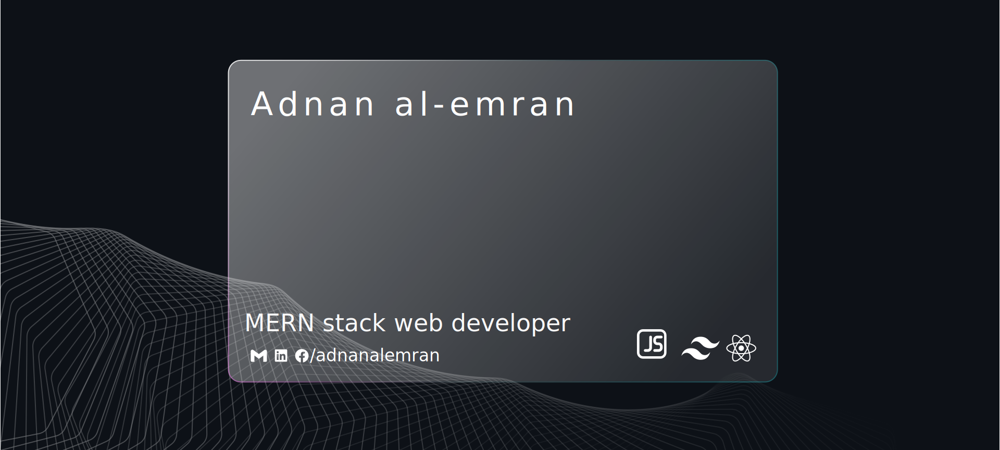

 

 

 

<h1 align="center">Hi , I'm Adnan</h1>  
<h2 align="center">I'm Adnan, a web developer</h2> 
 
 

 

<h2> About Me  </h2>

I specialize in MERN stack development, crafting robust and efficient web solutions. My work involves building dynamic applications with a focus on MongoDB, Express.js, React, and Node.js, ensuring seamless user experiences.
 
📫 Reach me at **adnanalemran@htmail.com**

  
  
<h2>Languages and Tools </h2>

   
   

  

   
   
<h2> My GitHub Stats  </h2>

 

 

 

 